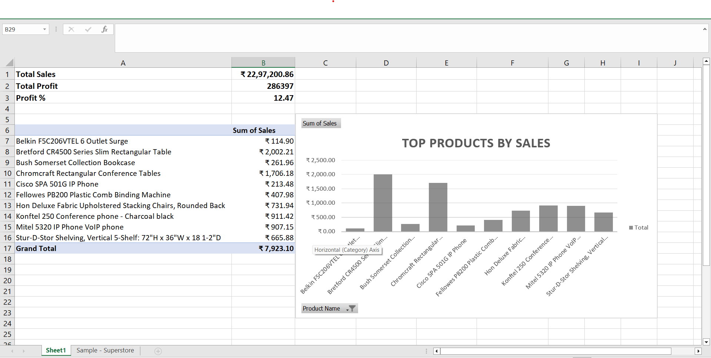

# 📊 Sales & Profitability Dashboard

## 🔹 Overview
This project analyzes sales data to generate insights on revenue, profitability, and top-performing products.

## 🔹 Tools Used
- Excel
- Pivot Tables
- Data Visualization

## 🔹 Key Insights
- Total Sales: ₹22,97,200
- Total Profit: ₹2,86,397
- Profit Margin: 12.47%

## 🔹 Features
- Data cleaning (fixed date formats, removed errors)
- Pivot table analysis for product performance
- Dashboard creation with KPIs

## 🔹 Dashboard

